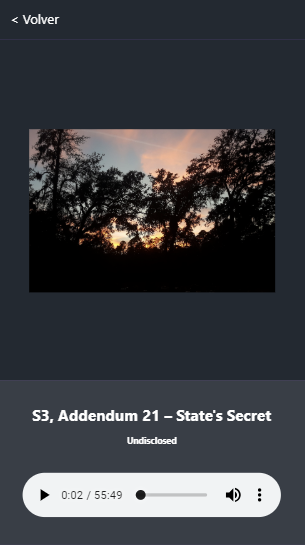

# App de Podcast

App de podcast integrada con la API de AudioBoom como prueba para el desarrollo de apps con Next.JS

[Ver la aplicación](https://podcast-nextjs-hjsi8pe9c.now.sh/)

## ¿Cómo funciona?

Requiere Node.Js 10

* `npm install` para instalar las dependencias.
* `npm run dev` para entorno de desarrollo.
* `npm run build && npm start` para el entorno de producción.

## Licencia

MIT
